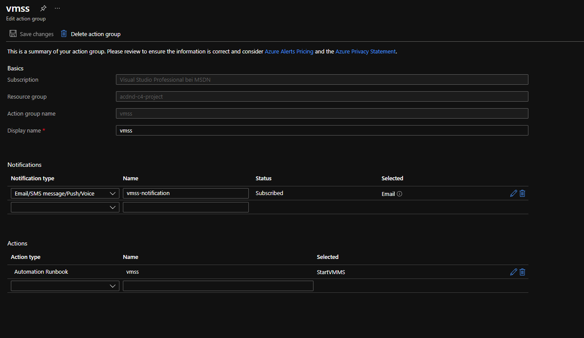

# Application Insights
## Azure Log Analytics Workspace and Azure Application Insights resources are created.

## Application Insight Events that show the results of clicking vote for each Dogs & Cats

## The output of the traces query in Azure Log Analytics

## The chart created from the output of the traces query

# Kubernetes Cluster
## The output of the Horizontal Pod Autoscaler, showing an increase in the number of pods

## The Application Insights metrics which show the increase in the number of pods.

## The alert I created.

## The email I received from the alert when the pod count increased.

# Autoscaling VMSS
Successful deployment via Azure Pipeline:

# Initial instance.

## The conditions for which autoscaling will be triggered (found in the 'Scaling' item in the VM Scale Set).
I used the 'Network Out Total' as the scaling metric.

## The Activity log of the VM scale set which shows that it scaled up with timestamp.

## The new instances being created.

## The metrics which show the load increasing, then decreasing once scaled up with timestamp.

# Runbook
I created a runbook that starts the VMSS. The alert gets triggered when the VMSS gets delocated.

## The alert configuration in Azure Monitor which shows the resource, condition, action group, and alert rule details.

## The email I received from the alert when the Runbook was executed.

## The summary of the alert which shows 'why did this alert fire?', timestamps, and the criterion in which it fired.

Runbook history with input and output:

VMSS activity log showing that the VMSS was stopped by me and started by the runbook:
